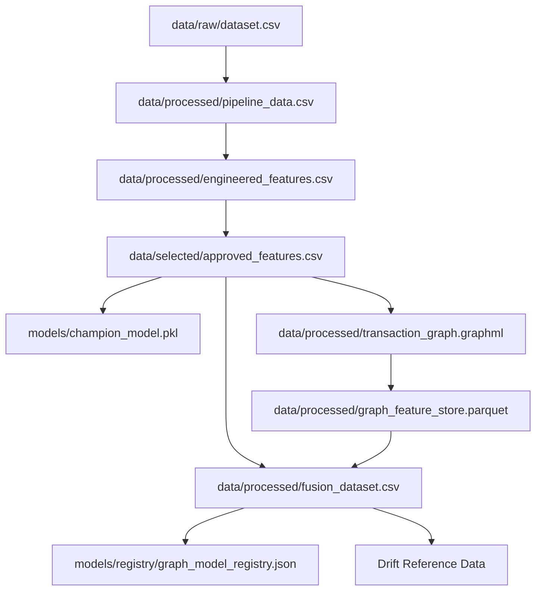

# Artifact Dependency Graph

```mermaid
graph TD
    A[data/raw/dataset.csv] --> B[data/processed/pipeline_data.csv]
    B --> C[data/processed/engineered_features.csv]
    C --> D[data/selected/approved_features.csv]
    D --> E[models/champion_model.pkl]
    D --> F[data/processed/transaction_graph.graphml]
    F --> G[data/processed/graph_feature_store.parquet]
    D --> H[data/processed/fusion_dataset.csv]
    G --> H
    H --> I[models/registry/graph_model_registry.json]
    H --> J[Drift Reference Data]
```
