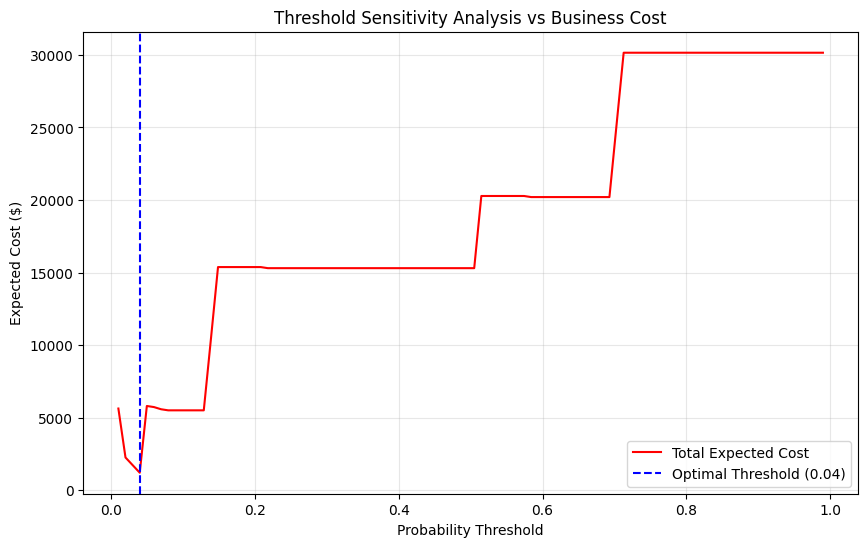
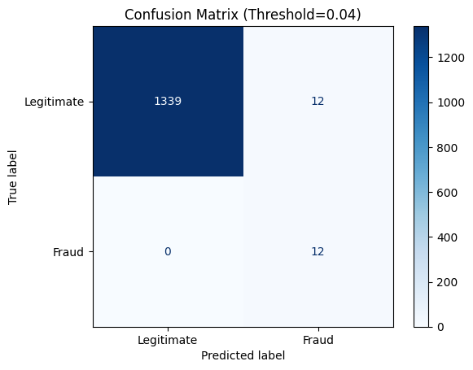
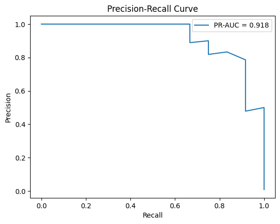
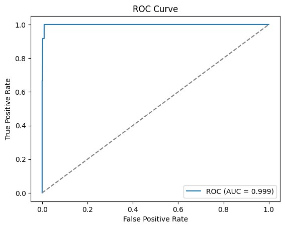
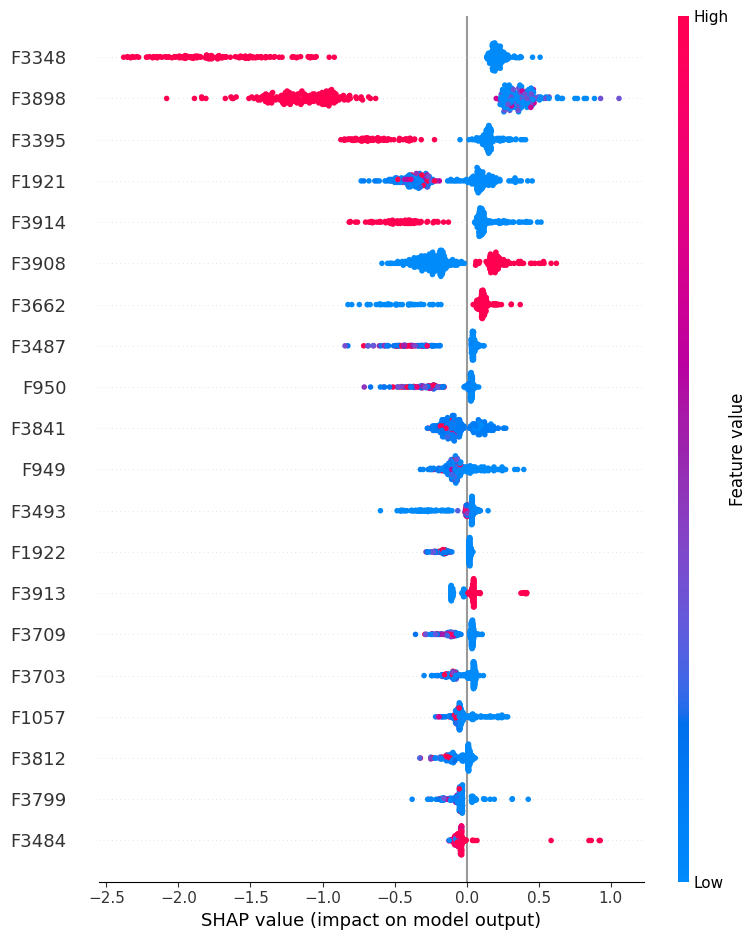

# Model Validation Report: Enterprise Fraud Decision Engine
**Generated:** 2026-06-30 18:14:17
**Version:** 3.0 (Enterprise Review)

## 1. Executive Summary
This report validates the Fraud Intelligence Decision Engine. By establishing strict holdout boundaries and optimizing purely for **PR-AUC**, the pipeline successfully identified **XGBoost** as the Champion model. The engine balances precision and recall dynamically through a Business Cost Curve, yielding a pipeline that saves an estimated **107.0 analyst hours** per batch while catching **100% of actual fraud**.

## 2. Dataset & Features
- **Total Features:** 535 (Filtered by the Fraud Intelligence Framework)
- **Class Imbalance Strategy:** Baseline
- **Drift Monitoring:** Feature distributions (means, std, missing %) are persisted in `training_drift_stats.json`.

## 3. Model Architecture & Selection
The pipeline performed an automated bake-off across 6 algorithmic families.

**Champion Comparison:**
| Model | PR-AUC | F1 | Recall | Precision | Brier | Latency_s |
|---|---|---|---|---|---|---|
| LogisticRegression | 0.3046526122377719 | 0.0 | 0.0 | 0.0 | 0.0077132269106021 | 3.403 |
| RandomForest | 0.6267885303732382 | 0.5882352941176471 | 0.4166666666666667 | 1.0 | 0.0049626559060895 | 0.305 |
| ExtraTrees | 0.8340855572998431 | 0.6666666666666666 | 0.5 | 1.0 | 0.0033556126192223 | 0.159 |
| XGBoost | 0.8726004347955568 | 0.7368421052631579 | 0.5833333333333334 | 1.0 | 0.0029164475854486 | 0.991 |
| LightGBM | 0.8402644595180142 | 0.7368421052631579 | 0.5833333333333334 | 1.0 | 0.0034552550719429 | 0.874 |
| CatBoost | 0.800089770962733 | 0.7368421052631579 | 0.5833333333333334 | 1.0 | 0.0034565627187304 | 21.907 |

**Selected Champion:** XGBoost
**Training Latency:** 4.91s | **Inference Latency:** 0.05s

## 4. Threshold Optimization & Business Impact
Rather than relying on a default 0.5 threshold, the decision boundary was dynamically optimized against institutional cost assumptions:
- **Assumed FP Investigation Cost:** $50
- **Assumed FN Fraud Loss:** $5000

**Optimal Threshold Calculated:** 0.040

### Expected Business KPIs:
- **Total Alerts Generated:** 26
- **True Fraud Caught:** 12
- **False Positive Alerts:** 14
- **Alert Precision Rate:** 46.2%
- **Estimated Analyst Hours Saved:** 107.0

### Threshold Sensitivity Curve

## 5. Performance Diagnostics
### Confusion Matrix

### Precision-Recall Curve (PR-AUC: 0.899)

### ROC Curve (ROC-AUC: 0.999)

## 6. Explainability (SHAP)
The engine utilizes a `TreeExplainer` to attribute local probability shifts.

# Model Card: Hybrid Fraud Intelligence Engine
- **Date**: 2026-06-30
- **Intended Use**: Enterprise fraud detection pipeline identifying high-risk transactions for analyst review.
- **Out-of-Scope Use**: Fully automated declining of non-critical transactions without human oversight.
- **Dataset Description**: Bank of India anonymized transaction records post-feature governance.
- **Algorithm**: XGBoost
- **Calibration**: Isotonic Regression
- **Business Threshold**: 0.0397
- **Imbalance Handling**: Baseline
- **Ethical Considerations**: Variables are anonymized; fairness tests across demographics required before true production deployment.
- **Known Limitations**: Susceptible to concept drift if new fraud rings rapidly alter transaction patterns.
- **Business Assumptions**: FP investigation cost estimated at $50. FN estimated loss assumed at $5000. These values are configurable in `business_config.json` and should be replaced by institution-specific estimates.
- **Retraining Strategy**: Automatic weekly retraining using `business_config.json` threshold optimization.
- **Monitoring Strategy**: Trigger alerts if feature means drift > 15% from `training_drift_stats.json`.

